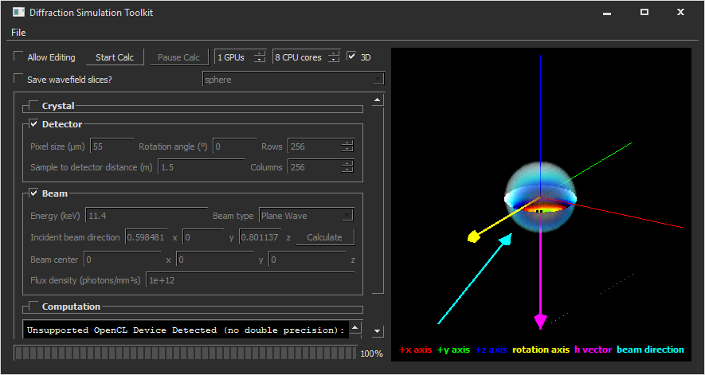

# Diffraction Simulation Toolkit
The Diffraction Simulation Toolkit allows simulation of dynamical diffraction experiments via a user-friendly graphical interface.

## Installation
This software is currently made available as a standalone executable (.exe) file on Windows, and will soon also be available as a Debian source package (.dsc) on Linux. To run the program on Windows, simply double-click the standalone "difsim.exe" file. If an error dialog appears, you may need to first install the following package: https://www.microsoft.com/en-ca/download/details.aspx?id=48145

## Authors
Produced at Brookhaven National Laboratory by:
* Hanfei Yan
* Ryan Hilbert

## Built With
* Qt - https://www.qt.io
* QCustomPlot - http://qcustomplot.com
* TinyExpr - https://codeplea.com/tinyexpr
